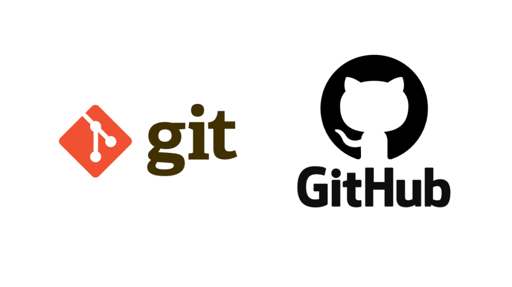

# Proyecto: Simulación de página principal de GitHub

Este proyecto es una simulación de la página principal de **GitHub**. Este proyecto tiene como objetivo **familiarizarnos con el uso de etiquetas HTML** mediante la creación de una página web que simula la interfaz de GitHub. A través de este proyecto, aprendimos a usar diversas etiquetas HTML para estructurar una página web.

# Descripción del Flujo de Trabajo 

Durante el desarrollo del proyecto, seguimos un flujo de trabajo basado en **Git** y **GitHub**, utilizando la rama principal (`main`) y ramas individuales para cada integrante del equipo, lo cuál nos permitió trabajar de manera independiente en tareas específicas y luego integrar los cambios de forma ordenada.

### Pasos seguidos:

1. **Clonación del repositorio**: Cada integrante clonó el repositorio desde GitHub a su máquina local para tener acceso al proyecto y trabajar en sus respectivas tareas.

2. **Creación de ramas individuales**: Cada miembro del equipo creó una nueva rama desde la rama `main` para trabajar en su tarea asignada. 

3. **Desarrollo en ramas**: Cada integrante trabajó en su propia rama, realizando los cambios necesarios, sin interferir con el trabajo de los demás.

4. **Commit de cambios**: Una vez completados los cambios en su rama, cada integrante realizó un commit con un mensaje descriptivo para registrar los cambios realizados.

5. **Sincronización con `main`**: Antes de integrar los cambios, cada desarrollador actualizó su rama con los últimos cambios de la rama `main` para evitar conflictos. Esto se logró mediante un `git pull` de la rama `main` hacia la rama de trabajo.

6. **Creación de Pull Request (PR)**: Cuando los cambios estuvieron listos, se creó un **Pull Request** desde la rama de trabajo hacia la rama `main`. Este PR fue revisado por el equipo antes de ser fusionado.

7. **Revisión y fusión de cambios**: Los Pull Requests fueron revisados para asegurar que todo estuviera correcto. Una vez aprobados, los cambios se integraron a la rama `main`.

## Características

- **Simulación de la Página Principal de GitHub**: Emula el diseño de la página de inicio de GitHub.

## Tecnologías Utilizadas

- **HTML5**: Estructura básica de la página.
- **CSS3**: Estilos para dar formato a la interfaz de usuario.

## Requisitos

Para ejecutar este proyecto en tu máquina local, asegúrate de tener lo siguiente:

- **Un navegador web** (Chrome, Firefox, Safari, etc.).

## Integrantes 

- Sebastián Torres
- David Cabrera
- Gustavo Castillo
- Osvaldo Velasco
- Perla Vázquez
